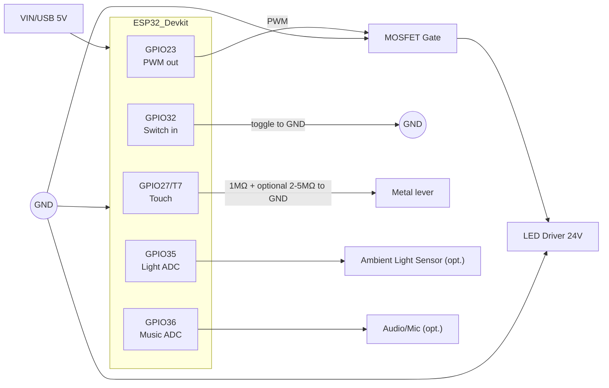

# Quarzlampe PWM Demo

This firmware drives a stone-lamp via ESP32 PWM patterns. It offers switch control, capacitive dimming, and optional BLE/BT interfaces.

## Hardware Overview



- Old toggle switch: one pole to GPIO32, other pole to GND (internal pull-up).
- Touch: lever isolated from switch contact, wired via 1 MΩ to GPIO27; optional 2–5 MΩ bleeder to GND.
- Optional sensors: GPIO35 for ambient light, GPIO36 for music/audio (only if built with `ENABLE_LIGHT_SENSOR` / `ENABLE_MUSIC_MODE`).

## Features

- Pattern sequencer (Konstant, Atmung, Atmung Warm, Sinus, Pulsierend, Funkeln, Kerze, Lagerfeuer, Stufen, Zwinkern, Gluehwuermchen, Popcorn, Weihnacht, Saber Idle, Saber Clash, Emergency Bridge, Arc Reactor, Warp Core, KITT Scanner, Tron Grid, Gewitter, Distant Storm, Rolling Thunder, Heat Lightning, Strobe Front, Sheet Lightning, Mixed Storm, Sonnenuntergang, Alert, SOS, Custom)
- Wake fade via `wake [soft] [mode=N] [bri=XX] <seconds>` (soft: touch cancels; mode/bri optional)
- Optional clap control via audio sensor (`clap on|off`, threshold/cooldown tunable)
- Classic BT serial + BLE command channel (configurable via `ENABLE_*` flags).
- Optional BLE-MIDI RX (receive-only) behind `ENABLE_BLE_MIDI=1` (standard BLE-MIDI service UUID; logs NoteOn/Off/CC).
- Optional BT-MIDI RX (classic SPP) behind `ENABLE_BT_MIDI=1` (parses NoteOn/Off/CC from BT serial and logs `[MIDI-BT] ...`).
  For Android automations you can use the [Tasker BLE Writer](https://github.com/Haschtl/Tasker-Ble-Writer) profile to send commands like `wake 180`.
- Physical switch: on/off + tap-to-cycle; capacitive hold-to-dim

### Configuration

- Compile-time flags live in `include/lamp_config.h` (`ENABLE_BLE`, `ENABLE_BT_SERIAL`).
- User-facing defaults (names, wake duration, brightness) are centralized in `include/settings.h`.

### BLE / BT Interface
- BLE Service UUID: `d94d86d7-1eaf-47a4-9d1e-7a90bf34e66b`
  - Command Characteristic UUID: `4bb5047d-0d8b-4c5e-81cd-6fb5c0d1d1f7` (Write/WriteNR/Notify) — send the text commands below, notifications carry feedback.
  - Status Characteristic UUID: `c5ad78b6-9b77-4a96-9a42-8e6e9a40c123` (Read/Notify) — read/subscribe for snapshots (same content as `status`).
- Classic BT (SPP): Device name from `Settings::BT_SERIAL_NAME` (default `Quarzlampe-SPP`); identical Text-Kommandos wie bei USB/BLE.
- Presence: BLE- oder SPP-Connect registriert die Peer-MAC und kann Auto-Off/On steuern (`presence`-Kommandos).
- Optional BLE-MIDI (RX-only, if built with `ENABLE_BLE_MIDI`): Service `03B80E5A-EDE8-4B33-A751-6CE34EC4C700`, Characteristic `7772E5DB-3868-4112-A1A9-F2669D106BF3` (Write/WriteNR). NoteOn/Off und einige CCs werden als `[MIDI] ...` geloggt (Serial/BLE notify) und können für Automationen genutzt werden.
- Optional BT-MIDI (RX-only, if built with `ENABLE_BT_MIDI`): verarbeitet NoteOn/Off/CC aus dem Classic-BT-Serial-Stream und loggt als `[MIDI-BT] ...`.

## How-to program an app for this device

- **Connect via BLE**: Discover the service UUID `d94d86d7-1eaf-47a4-9d1e-7a90bf34e66b`. Write plain-text commands to the Command Characteristic (`4bb5047d-0d8b-4c5e-81cd-6fb5c0d1d1f7`). Subscribe/notify on both Command (for ACK/Logs) and Status (`c5ad78b6-9b77-4a96-9a42-8e6e9a40c123`) for snapshots.
- **Or via SPP (Classic BT)**: Connect to the device name (default `Quarzlampe-SPP`) and send the same ASCII commands as over BLE/USB. Read lines for feedback.
- **Core commands to implement**: `on/off/toggle`, `bri <0..100>`, `mode <n>`, `next/prev`, `wake <s>`/`sleep <min>`, `status`, plus optional `ramp`, `idleoff`, `presence` and `custom`/`music` if used.
- **Status parsing**: The Status Characteristic gives a single-line snapshot; you can also request `status` via command and parse the notify. Touch/Light logs appear as separate notify messages.
- **Optional sensors/features**: If built with `ENABLE_LIGHT_SENSOR`/`ENABLE_MUSIC_MODE`, expose toggles in your UI (`light on/off/calib`, `music on/off`). Presence can be managed in-app with `presence set me` after connecting.
- **Config import/export**: Use `cfg export` to read all settings as a single `cfg import ...` line you can store/rest. Apply with `cfg import ...` to restore user prefs.

## Command Reference

All commands can be sent via USB serial, BLE, or classic BT serial:

| Command             | Description                                                |
|---------------------|------------------------------------------------------------|
| `list`              | Print all available patterns                               |
| `mode <n>`          | Immediately switch to pattern number `n`                   |
| `next` / `prev`     | Cycle to the next or previous pattern                      |
| `on` / `off` / `toggle` | Switch lamp on/off like the hardware toggle               |
| `bri min/max <0..1>` | Set min/max brightness clamp                               |
| `auto on\|off`       | Enable/disable automatic pattern cycling                   |
| `bri <0..100>`      | Set master brightness in percent                           |
| `bri cap <0..100>`  | Set hard brightness cap (percent, applies to all ramps)    |
| `wake [soft] [mode=XX] [bri=XX] <seconds>` | Wake fade with options (soft: touch cancels; mode/bri optional) |
| `wake stop`         | Abort an active wake fade                                  |
| `sos [stop]`        | Start SOS alert (100% brightness, SOS pattern); stop restores previous state |
| `sleep [minutes]`   | Fade down to off over given minutes (default 15)           |
| `sleep stop`        | Abort an active sleep fade                                 |
| `ramp <ms>`         | Set both on/off brightness ramp durations (50–10000 ms)    |
| `ramp on <ms>`      | Set on-ramp duration only (50–10000 ms)                    |
| `ramp off <ms>`     | Set off-ramp duration only (50–10000 ms)                   |
| `ramp ease on|off <linear|ease|ease-in|ease-out|ease-in-out> [power]` | Set easing curve and optional power for on/off ramps |
| `idleoff <minutes>` | Auto-off after given minutes (0=disabled)                  |
| `touch tune <on> <off>` | Adjust touch thresholds (on>off>0)                       |
| `touchdim on/off`   | Enable/disable touch dimming                               |
| `pwm curve 0.5-4`  | Adjust PWM gamma/curve (linearization)                      |
| `clap on/off` / `clap thr <0..1>` / `clap cool <ms>` | Audio clap toggle/threshold/cooldown (requires music build) |
| `touch`             | Print raw touch readings for threshold calibration         |
| `calibrate touch`   | Guided touch calibration (baseline + thresholds)           |
| `calibrate`         | Re-measure touch baseline                                  |
| `notify d1 d2 ... [fade=ms]` | Blink notification sequence (ms, optional fade per edge) |
| `morse <text>`        | Blink Morse code for given text (dot=200ms, dash=600ms)        |
| `profile save <1-3>/load <1-3>` | Save/load user profile (without touch/presence/quick/idle) |
| `presence on|off`   | Enable/disable auto-off when registered device disconnects |
| `presence set <MAC>`/`presence set me`/`presence clear` | Bind connected device or explicit MAC / clear |
| `presence grace <ms>` | Set grace timeout before presence-off                      |
| `custom v1,v2,...`  | Set custom pattern values (0..1)                           |
| `custom step <ms>`  | Set custom pattern step duration                           |
| `light [on/off/calib]`    | Enable/disable light sensor and (calib) reset min/max (if built with ENABLE_LIGHT_SENSOR) |
| `light gain <f>` / `light clamp <min> <max>` | Adjust sensor gain and clamp (if built with ENABLE_LIGHT_SENSOR) |
| `music [on/off]`    | Enable/disable music mode (ADC, if built with ENABLE_MUSIC_MODE) |
| `music sens <f>`    | Adjust music sensitivity (if built with ENABLE_MUSIC_MODE) |
| `cfg export`        | Dump as `cfg import ...` line you can paste back in          |
| `cfg import key=val ...` | Import settings (ramp, idle, touch_on/off, bri, auto, presence) |
| `factory`           | Reset all settings to defaults                             |
| `status`            | Show current pattern, brightness and wake/auto state       |
| `help`              | Display the quick command overview                         |

Tasks or mobile workflows (e.g., Tasker) can simply send these ASCII commands.

## Web BLE UI & GitHub Pages

- A static Web BLE UI is provided in `webble.html` (no build step required).
- **New (React/Vite)**: A modern UI scaffold lives in `frontend/` (React + Tailwind). Install and run locally with:
  ```sh
  cd frontend
  npm install
  npm run dev   # npm run build for production
  ```
  (This repo’s Web Bluetooth logic still needs to be ported into the new React app; current scaffold shows layout only.)
- To host via GitHub Pages: enable Pages in repo settings and set the source to the `main` branch, root (`/`). The UI will be available at `https://haschtl.github.io/<repo>/webble.html` (replace `<repo>` with this repo name). Example: [https://haschtl.github.io/Steinlampe/webble.html](https://haschtl.github.io/Steinlampe/webble.html).
- Open the page in a Web-Bluetooth-capable browser (Chrome/Edge/Android) over HTTPS or `localhost`, click **Connect**, and control the lamp.

## Build

```sh
pio run -e upesy_wroom
```

*Note: PlatformIO must be installed locally. In this environment `pio` is not available.*
